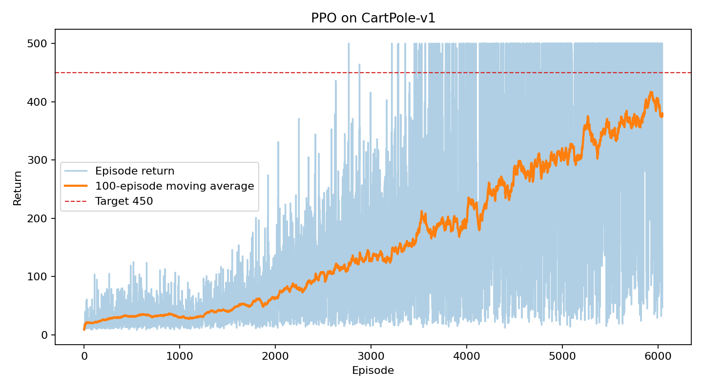
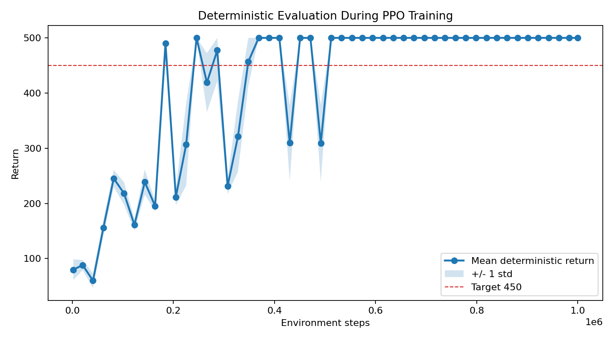
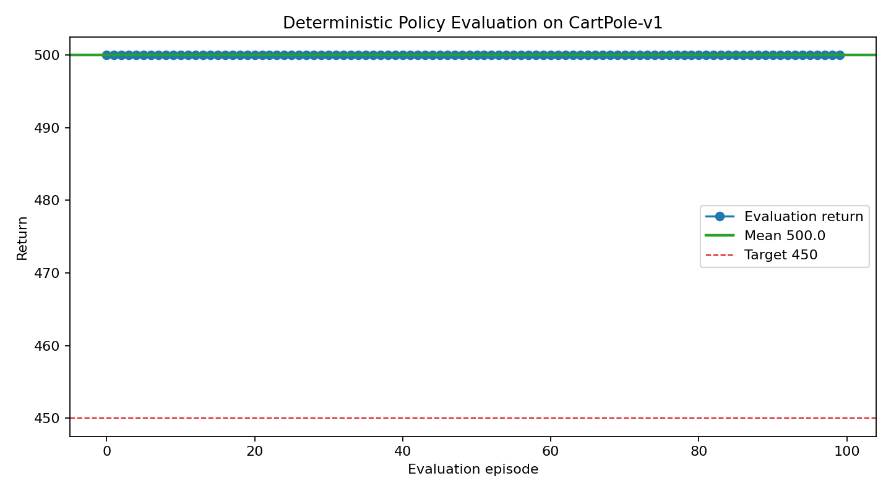

# SimWorld PPO CartPole Submission

This repository contains my reinforcement learning submission for the SimWorld
research exploration task. I implemented Proximal Policy Optimization (PPO)
from scratch on `CartPole-v1` using PyTorch and Gymnasium.

## Task

Option A: Reinforcement Learning

- Environment: `CartPole-v1`
- Algorithm: PPO implemented from scratch
- Target: average reward >= 450 over 100 episodes
- Deliverables: Colab notebook, training logs, reward curves, and README

## Summary

The final policy reaches the maximum CartPole-v1 score during evaluation:

```text
Final evaluation episodes: 100
Mean return: 500.00
Standard deviation: 0.00
Minimum / maximum return: 500.00 / 500.00
```

The completed run is included in:

```text
runs/cartpole-v1_ppo_seed42_1780379310/
```

## Implementation

The PPO implementation is in `src/ppo_cartpole.py`. It does not call
`stable-baselines`, `stable-baselines3`, or any other high-level RL trainer.
The main algorithmic components are implemented directly:

- Actor-critic neural network with separate policy and value heads
- Vectorized rollout collection with `SyncVectorEnv`
- Categorical action sampling for the discrete CartPole action space
- Generalized Advantage Estimation (GAE)
- PPO clipped policy objective
- Value-function loss
- Entropy bonus
- Minibatch optimization and gradient clipping
- Final deterministic 100-episode evaluation

## Results

Final Colab run:

```text
Run directory: runs/cartpole-v1_ppo_seed42_1780379310
Training episodes collected: 6046
Training last-100 stochastic rollout average return: 375.90
Deterministic evaluation mean return over 100 episodes: 500.00
Evaluation standard deviation: 0.00
Evaluation min / max return: 500.00 / 500.00
```

The training curve below is collected from stochastic rollout episodes during
PPO optimization. Because training uses sampled actions for exploration, this
curve can stay noisy even after the deterministic policy has learned a strong
solution.



The deterministic evaluation progress curve tracks the greedy policy during
training and is a less noisy view of policy quality than sampled rollouts.



The final evaluation curve uses the trained deterministic policy over 100
episodes. It reaches the maximum CartPole-v1 return of 500 in every episode.



Key artifacts:

- `runs/cartpole-v1_ppo_seed42_1780379310/metrics.csv`
- `runs/cartpole-v1_ppo_seed42_1780379310/eval_progress.csv`
- `runs/cartpole-v1_ppo_seed42_1780379310/summary.json`
- `runs/cartpole-v1_ppo_seed42_1780379310/evaluation.json`
- `runs/cartpole-v1_ppo_seed42_1780379310/model.pt`

## Design Notes

I chose CartPole because it is a small, interpretable benchmark for verifying
the mechanics of PPO while staying reliable on free Colab. The implementation
uses vectorized rollouts to collect samples efficiently, and the PPO pieces are
kept explicit rather than hidden behind a high-level RL wrapper.

During tuning, I found that an aggressive PPO update could still produce a
strong greedy policy, but the sampled training rollouts remained noisy. I
treated that as a stability issue and moved to a more conservative setup:
smaller learning rate, fewer update epochs, no entropy bonus in the final run,
a `target_kl` guard, and a larger training budget. This made later policy
updates smoother while preserving the final 100-episode evaluation score.

I report both stochastic training rollouts and deterministic evaluation. The
rollout curve is useful for seeing learning progress under sampled actions,
while the deterministic evaluation progress curve is a cleaner view of the
learned policy quality. This is why both curves are included in the results.

## Colab Notebook

Open the notebook in Google Colab:

[https://colab.research.google.com/github/0ozcharles/simworld-ppo-cartpole/blob/main/notebooks/ppo_cartpole_colab.ipynb](https://colab.research.google.com/github/0ozcharles/simworld-ppo-cartpole/blob/main/notebooks/ppo_cartpole_colab.ipynb)

The notebook installs dependencies, loads the project implementation, trains
the PPO agent, plots the curves, and runs the final 100-episode evaluation.

Recommended Colab settings:

- Runtime: Python 3
- Hardware accelerator: GPU optional. CartPole also runs comfortably on CPU.

## Run Locally

Install dependencies:

```bash
pip install -r requirements.txt
```

Train with the default configuration:

```bash
python src/ppo_cartpole.py
```

Run a short smoke test:

```bash
python src/ppo_cartpole.py --total-timesteps 4096 --num-envs 2 --num-steps 64 --eval-episodes 5
```

## Repository Structure

```text
.
|-- notebooks/
|   `-- ppo_cartpole_colab.ipynb
|-- runs/
|   `-- cartpole-v1_ppo_seed42_1780379310/
|       |-- reward_curve.png
|       |-- eval_progress_curve.png
|       |-- evaluation_curve.png
|       |-- metrics.csv
|       |-- eval_progress.csv
|       |-- summary.json
|       |-- evaluation.json
|       |-- config.json
|       `-- model.pt
|-- src/
|   `-- ppo_cartpole.py
|-- scripts/
|   |-- check_project.py
|   `-- make_evaluation_curve.py
|-- requirements.txt
`-- README.md
```

The main submission code is in `src/` and the Colab notebook is in
`notebooks/`. The `scripts/` folder only contains small utility scripts for
local checks and regenerating result plots.
